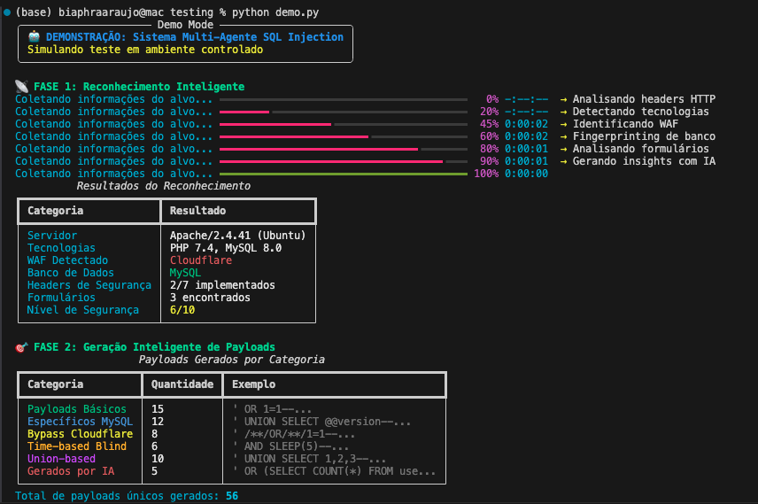

# Sistema Multi-Agente de Teste SQL Injection



Um sistema avançado de teste de segurança que utiliza **5 agentes especializados de IA** para detectar vulnerabilidades de SQL Injection de forma inteligente e automatizada.

## 🌟 Características Principais

- **🧠 Inteligência Artificial**: Utiliza LangChain + OpenAI para análise contextual
- **🤖 Multi-Agentes**: 5 agentes especializados trabalhando em conjunto
- **🎯 Testes Adaptativos**: Payloads gerados dinamicamente baseados no alvo
- **🔓 Evasão Avançada**: Bypass inteligente de WAFs e filtros
- **📊 Relatórios Detalhados**: Análise de risco e recomendações acionáveis

## 🏗️ Arquitetura Multi-Agente

### 1. 🕵️ Agent Reconnaissance
- Coleta informações detalhadas sobre o alvo
- Detecta tecnologias, WAFs e estruturas
- Análise de headers, formulários e endpoints
- Fingerprinting de banco de dados

### 2. 🎯 Agent Payload Generator  
- Gera payloads dinâmicos e contextuais
- Específicos por tipo de banco de dados
- Adaptados para bypass de proteções
- Utiliza IA para criação personalizada

### 3. 🔍 Agent Response Analyzer
- Análise inteligente das respostas HTTP
- Detecção de padrões de erro sutis
- Comparação com baseline
- Classificação de confiança e severidade

### 4. 🔓 Agent Evasion Specialist
- Técnicas avançadas de bypass de WAF
- Obfuscação e encoding de payloads
- Adaptação baseada em falhas anteriores
- Evasão específica por tipo de proteção

### 5. 📊 Agent Report Generator
- Relatórios executivos e técnicos
- Análise de risco e impacto no negócio
- Recomendações de correção
- Múltiplos formatos (JSON, HTML, Markdown)

## 🚀 Instalação

### 1. Clonar dependências
```bash
pip install -r requirements.txt
```

### 2. Configurar API Key
```bash
cp .env.example .env
# Editar .env e adicionar sua OPENAI_API_KEY
```

### 3. Testar instalação
```bash
python demo.py
```

## 💻 Uso

### Teste Básico
```bash
python multiagent_sqli_tester.py https://example.com/search.php query
```

### Teste Avançado
```bash
python multiagent_sqli_tester.py https://example.com/search.php query 100
```

### Parâmetros
- **URL**: URL do alvo para teste
- **Parâmetro**: Nome do parâmetro vulnerável (padrão: 'query')
- **Max Payloads**: Número máximo de payloads (padrão: 50)

## 📋 Exemplo de Execução

```
🤖 Sistema Multi-Agente de Teste SQL Injection
Alvo: https://example.com/search.php
Parâmetro: query

📡 Fase 1: Reconhecimento
✅ Tecnologias detectadas: PHP 7.4, MySQL 8.0
✅ WAF detectado: Cloudflare
✅ Banco identificado: MySQL

🎯 Fase 2: Geração de Payloads  
✅ 56 payloads únicos gerados
✅ Incluindo técnicas de bypass Cloudflare

🔍 Fase 3: Execução de Testes
✅ Vulnerabilidade Error-based detectada
✅ Vulnerabilidade Time-based detectada
✅ 4 vulnerabilidades encontradas

📊 Fase 4: Geração de Relatório
✅ Relatório JSON salvo
✅ Relatório HTML salvo
✅ Relatório Markdown salvo
```

## 📊 Tipos de Vulnerabilidades Detectadas

- **Error-based**: Baseada em mensagens de erro SQL
- **Time-based**: Blind SQL injection com delays
- **Union-based**: Extração de dados com UNION SELECT
- **Boolean-based**: Blind SQL injection lógica

## 🛡️ Técnicas de Evasão

- **Comment Insertion**: `/**/` entre keywords
- **Case Variation**: `UnIoN sElEcT`
- **URL Encoding**: `%27%20OR%201=1--`
- **Keyword Replacement**: `||` em vez de `OR`
- **Character Encoding**: Hex, Unicode, Base64
- **WAF-Specific**: Técnicas por tipo de WAF

## 📈 Relatórios Gerados

### Resumo Executivo
- Nível de risco geral
- Número de vulnerabilidades
- Impacto no negócio
- Ações imediatas necessárias

### Detalhes Técnicos
- Análise de cada vulnerabilidade
- Payloads bem-sucedidos
- Técnicas de evasão utilizadas
- Dados do reconhecimento

### Recomendações
- Correções imediatas
- Melhorias de curto prazo
- Estratégias de longo prazo
- Medidas preventivas

## 🔧 Configuração Avançada

### config.py
```python
# Personalizar configurações
OPENAI_MODEL = 'gpt-4-turbo-preview'
TEMPERATURE = 0.7
MAX_TOKENS = 2000
REQUEST_TIMEOUT = 10
```

### Payloads Customizados
```python
# Adicionar payloads específicos
CUSTOM_PAYLOADS = [
    "' OR 1=1--",
    "' UNION SELECT version()--"
]
```

## 🎯 Casos de Uso

### Pentest Profissional
- Testes de penetração automatizados
- Relatórios para clientes
- Análise de risco detalhada

### Bug Bounty
- Descoberta rápida de vulnerabilidades
- Bypass de proteções avançadas
- Documentação profissional

### Desenvolvimento Seguro
- Testes durante desenvolvimento
- Validação de correções
- Treinamento de equipes

## ⚠️ Avisos Legais

- **Use apenas em sistemas autorizados**
- **Respeite termos de serviço**
- **Não use para atividades maliciosas**
- **Responsabilidade do usuário**

## 🤝 Contribuições

Contribuições são bem-vindas! Por favor:

1. Fork o projeto
2. Crie uma branch para sua feature
3. Commit suas mudanças
4. Push para a branch
5. Abra um Pull Request

## 📝 Licença

Este projeto é licenciado sob MIT License - veja o arquivo LICENSE para detalhes.

## 🆘 Suporte

Para suporte e dúvidas:
- Abra uma issue no GitHub
- Consulte a documentação
- Execute `python demo.py` para ver exemplos

## 🔄 Roadmap

- [ ] Integração com mais LLMs
- [ ] Interface web
- [ ] Testes NoSQL
- [ ] API REST
- [ ] Dashboard em tempo real
- [ ] Integração CI/CD

---

**Desenvolvido com ❤️ para a comunidade de segurança cibernética**
